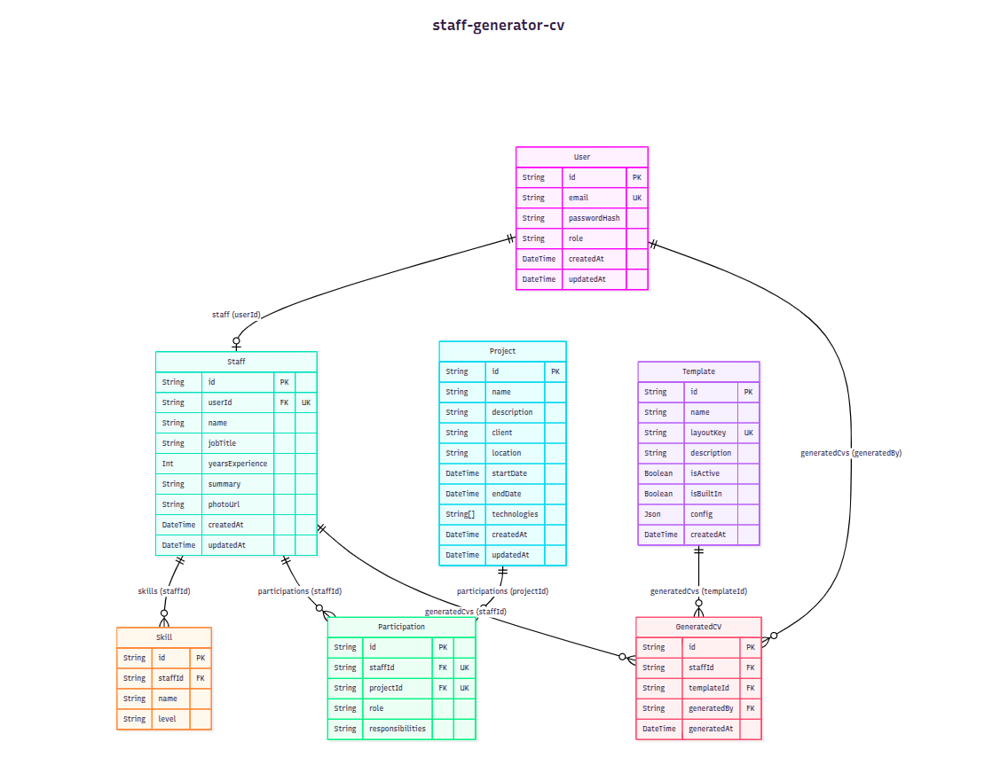

# Staff CV Generator

An internal tool for HR to generate standardized CVs for staff members to send to clients.

## Project Details

- **Implementation Time**: ~18 hours
- **Demo Link**: [https://staff-cv-generator.hakaytna.store/](https://staff-cv-generator.hakaytna.store/)
  - **Email**: `admin@cvgenerator.local`
  - **Password**: `password123`

### User Roles
- **Admin**: Can add and update all resources.
- **Staff**: Can only update their profile and view their assigned projects.

## Tech Stack

- **Frontend**: React 18, Vite, Tailwind CSS v4, ShadCn UI, React Query, React PDF.
- **Backend**: Node.js, Express, PostgreSQL (Prisma ORM), Zod.
- **Tooling**: Turborepo, pnpm workspaces, TypeScript.

## Architecture

- **Monorepo**: This project uses Turborepo and pnpm workspaces to manage `apps/` (frontend, backend) and `packages/` (shared config, types/utils).
- **Feature-Based Architecture**: The codebase (especially the backend) is organized by domain features (e.g., auth, staff, cv) to promote scalability and encapsulation.

## Database ERD



View the interactive database ERD diagram here: [Mermaid ERD](https://mermaid.ai/d/5506dabe-3cae-489f-a32d-b76b7dd94f65)

## Getting Started

### Prerequisites

- Node.js >= 20
- pnpm >= 9
- PostgreSQL database instance

### Installation

```bash
pnpm install
```

### Environment Setup

Copy `.env.example` to `.env` in the respective apps and configure your database URL.

### Database Setup

To set up and manage the database, the following Prisma commands are available in the `apps/backend` (or via the root if forwarded):

- `pnpm run db:push` - Pushes the Prisma schema state to the database without generating migrations.
- `pnpm run db:migrate` - Runs `prisma migrate dev` to apply migrations to the development database.
- `pnpm run db:generate` - Runs `prisma generate` to generate the Prisma Client.
- `pnpm run db:seed` - Seeds the database with initial data using `tsx prisma/seed.ts`.

### Running the App

Run the development servers concurrently using Turbo:

```bash
pnpm run dev
```
