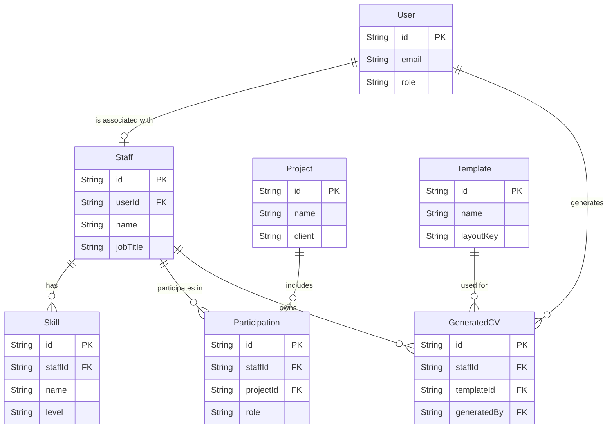

# README Design Specification

## 1. Overview
**Topic**: Project README documentation.
**Purpose**: To provide a clear, concise guide for new developers, outlining the project's purpose, architecture, tech stack, and setup instructions.
**Tone**: Standard & Concise (straight to the point, focused on getting started).

## 2. Target Audience
- **Primary**: Developers onboarding to the project.
- **Project Context**: An internal tool for HR to generate standardized CVs for staff members to send to clients.

## 3. Structure Outline

### 3.1 Header & Summary
- **Title**: Staff CV Generator
- **Description**: A brief, 1-2 sentence summary highlighting the tool's purpose (HR internal tool for standardized client-facing CV generation).

### 3.2 Tech Stack
A concise bulleted list of the core technologies used in the project:
- **Frontend**: React 18, Vite, Tailwind CSS v4, Radix UI, React Query, React PDF.
- **Backend**: Node.js, Express, PostgreSQL (Prisma ORM), Zod.
- **Tooling**: Turborepo, pnpm workspaces, TypeScript.

### 3.3 Architecture
A brief section explaining the structural decisions:
- **Monorepo**: Mention the use of Turborepo and pnpm workspaces to manage `apps/` (frontend, backend) and `packages/` (shared config, types/utils).
- **Feature-Based Architecture**: Note that the codebase (especially the backend) is organized by domain features (e.g., auth, staff, cv) to promote scalability and encapsulation.

### 3.4 Database ERD
We will include a Mermaid ERD diagram showing the core relationships, based on the Prisma schema:

### 3.5 Getting Started
Step-by-step instructions for local development:
- **Prerequisites**:
  - Node.js >= 20
  - pnpm >= 9
  - PostgreSQL database instance
- **Installation**:
  - Run `pnpm install` at the root.
- **Environment Setup**:
  - Note to copy `.env.example` to `.env` (if applicable) and configure database URLs.
- **Database Setup**:
  - Commands to push schema and seed the database (e.g., `pnpm run db:push` in backend).
- **Running the App**:
  - Run `pnpm run dev` from the root to start both frontend and backend concurrently via Turbo.
